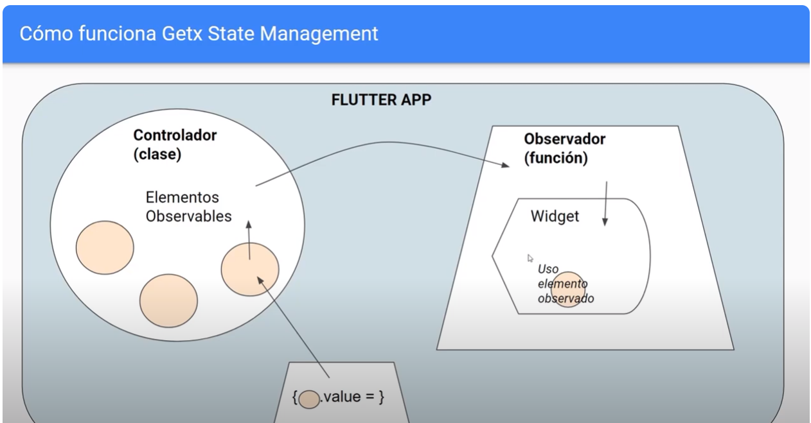
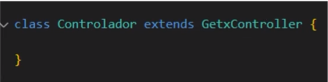
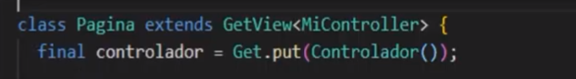
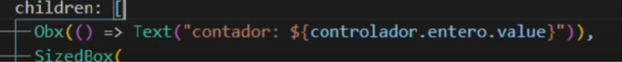

# FlutterGetX

Es una aplicación sencilla de Flutter desarrollada a través de la librería GetX para gestionar el estado de la app.

## Implementaciones 🛠️

* Preparar el programa - Getx
* Definir controlador
* Tipos de elementos observables
* Definir observador
* Modificar elemento observable
* Objetos personalizados observables (custom objects)
* Caso especial - Listas
* Llamar a api asíncrona mediante StateMixin
* Reaccionar al StateMixin
* Controlador global.
* Inyectado en la ruta.

## GetX ♻️

GetX es un gestor de estado basado en la observación de elementos de dicho estado. Esta formado por dos elementos pricipales:

- **Controladores**: contienen elementos observables a nivel interno dentro de las clases.

- **Observadores**: en los observadores tenemos las funciones que van a modificar el estado cuando el elemento observado sea modificado.

Cuando hacemos alguna modificación de algún elemento en el código, al ser observado este lo notifica al controlador, que a su vez lo notifica al observador y es entonces cuando el observador pide reescribirse a todos sus witges.

Se define primero el controlador que extiende de GetxController

depués se añaden los elementos observables con la manera simplificada de Getx

Una vez definido el controlador, pasamos a definir el observador. Para ello se instancia primero el controlador.

Después difinimos el observador haciendo un "wrap" del widget que será actualizado una vez lo notifique el controlador cuando haya cambiado

Dentro del observador usamos al menos un elemento observable que al cambiar su valor, hará que el controlador lo notifique y el observador volverá a reescribir el widget

El objetivo de este proyecto es mostrar la funcionalidad de un contador y realización de llamadas a una API además de utilizar controladores globales con las implementaciones de GetX definidas anteriormente

## Funcionalidad 📱

[getx](https://github.com/jllanas1986/Flutter_GetX_counter/assets/122029674/a8758b6c-3a1f-4513-9065-26182eb5531e)

## Recursos 📚

[Locos por Flutter y Dart](https://www.youtube.com/@locosporflutterydart3874)

## Autor ✒️

- **Jose Llanas** - [jllanas1986](https://github.com/jllanas1986)
